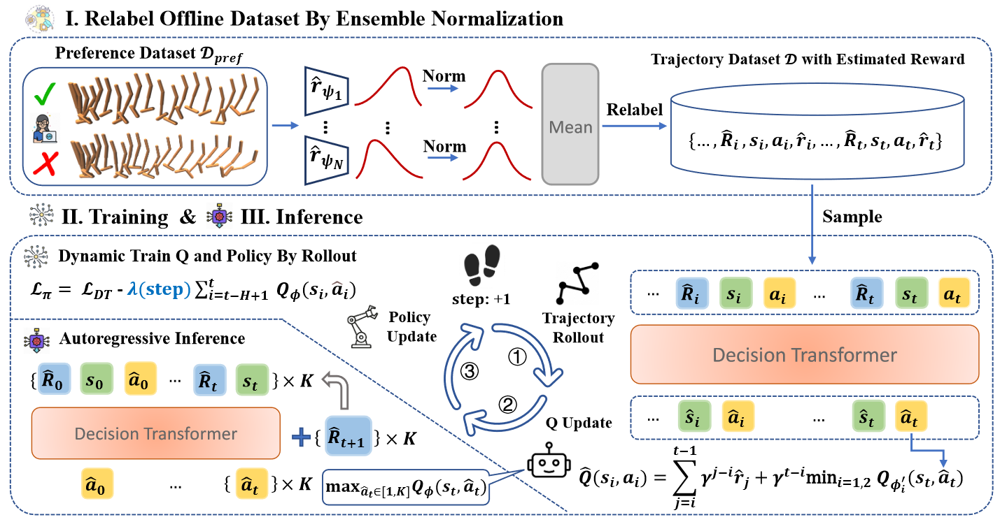

## Code for In-Dataset Trajectory Return Regularization for Offline Preference-based Reinforcement Learning

Code for "In-Dataset Trajectory Return Regularization for Offline Preference-based Reinforcement Learning", AAAI2025 paper.

## Introduction

We proposed In-Dataset Trajectory Return Regularization (DTR) for offline preference-based reinforcement learning (PbRL). DTR addresses reward bias challenges in trajectory-level preference feedback by combining Conditional Sequence Modeling (CSM) and TD-Learning (TDL). Key features include balancing in-dataset trajectory returns with optimal action selection and employing ensemble normalization for robust reward estimation. Experimental results demonstrate DTR's superior performance over state-of-the-art baselines.

<p align="center">
    <br>
    
    <br>
<p>

---


## Quick Start
1. train reward model
``` Bash
cd reward_learning/rlhf
python train_reward_model.py domain="mujoco" env="hopper-medium-replay-v2" modality="state" structure="mlp" \
            fake_label=false  ensemble_size=3 n_epochs=50 num_query=2000 len_query=200 \
            data_dir="../crowdsource_human_labels" seed=999 exp_name="CS-MLP"
```

2. relabel the dataset
``` Bash
cd rlhf
python save_traj_dataset.py  env="hopper-medium-replay-v2" reward_model_path=$your_model_path pkl_path=$your_pkl_path
```

3. create the traj dataset
``` Bash
cd D4RL
python create_dataset_pref.py
```

4. train the DTR
``` Bash
python experiment.py --seed 0  --env hopper --dataset medium-replay  \
    --eta 3.0 --grad_norm 9.0  --exp_name DTR --save_path $your_save_path  \
    --max_iters 50 --num_steps_per_iter 1000  --lr_decay  \
    --early_stop --k_rewards --use_discount  --K 20   --norm_r 
```

---
## Acknowledgements

Special thanks to the following open-source projects for their inspiration and technical support:

- [Uni-RLHF-Platform](https://github.com/pickxiguapi/Uni-RLHF-Platform)
- [QT](https://github.com/charleshsc/QT)